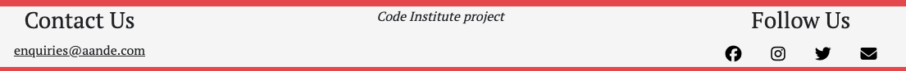

# Anything and Everything

The live link can be found here - [Anything and Everything](https://anything-and-everything-be0c15127928.herokuapp.com/)

Anything and Everything is a advertising app for users who wish to post about items they are selling, wish to buy, need help or guidance with or simply to reach out to the community.

The site acts as a area where users can communicate with other users.

## **Index - Table of Contents**

- [User Experience (UX)](#user-experience-ux)
- [Features](#features)
- [Design](#design)
- [Agile Methodology](#agile-methodology)
- [Data Model](#datamodel)
- [Testing](#Testing)
- [Security Features and Defensive Design](#security-features-and-defensive-design)
- [Deployment](#deployment)
- [Frameworks - Libraries - Programmes Used](#frameworks-libraries-programes-used)
- [Credits](#credits)
- [Acknowledgements](#acknowledgements)

## **User Experience (UX)**

A Visitor to Anything and Everything would be someone who is likely to want to buy or sell items, might be looking for services such as a plumber or cleaner. Other Visitors would be people wanting to browse to see what is available.

### User Stories

#### EPIC - User Profile
- As a Site User I can register my account so that I can add, edit, delete posts and comment on other peoples posts.
- As a Site User, I can log in or log out of my account so that I can keep my account secure.
- As a Site User I can see my login status so that I know if I'm logged in or out.

#### EPIC - User Navigation
- As a Site User, I can clearly understand the purpose of the site so that I can decide if it meets my needs.
- As a Site User, I can navigate around the site so that I can find content and understand where I am on the site.
- As a Site User, I can view the latest posts.
- As a Site User, I can click on the posts so that I can read the full detail and view other comments left by users.

#### EPIC - Post Management
- As a Site User, I can post anything and everything onto the app through an easy to use interface so that I can share with other users.
- As a Site User, I can edit and delete posts that I have created so that I can easily make changes without having to start over.
- As a Site User, I can view only my posts so that I can quickly see and respond to comments in one location.

#### EPIC - Post Interation
- As a Site User, I can comment on other users posts so that I can interact with them.
- As a Site User, I can edit and delete comments that I have created so that I can easily make changes if I have made a mistake.

#### EPIC - Site Administration
- As a Site Administrator, I can create, read, update and delete posts and comments so that I can manage the app content.

## **Existing Features**

### Header

**Navigation Bar**

- The navigation bar is present at the top of every page and includes links to sign up or login.
- When the user has logged in, their username appears in which they are able to interact with this.

- The options to Sign-up or Log in will change to the option to log out once the user has logged in.

### Footer

- The footer section includes icons for Facebook, Instagram, Email and Twitter.
- There is also a contact detail for the company.
- These links do not work and are fictitious for the purpose of this project.

### Home Page

- The home page includes a sign-up section which encourages the user to register.
- The sign-up button takes the user to the sign-up page.
- If a user is already signed in the message changes to "Add a Post" and the user is encouraged to create a new post.
- The sign-up button changes to a "Add a Post" button which takes the user to the Add a Post page.

### User Account Pages

**Sign Up**

**Sign In**

**Sign Out**

- Django allauth was installed and used to create the Signup, Signin and Signout functionality.
- Success messages inform the user if they have signed in and signed out successfully.

### Browse Posts

- The homepage displays all posts with the most recent post displayed first. 
- There is pagination applied to which users can click "Next" and "Prev" after 6 posts.
- Each post displays the post image with a default image of the logo if one hasnt been uploaded.
- Clicking on the title of the post will take you directly to that post detail page.

### User Posts

- Upon signing in, the user will be able to click their username on the nav bar which takes them to their own posts.
- As well as the home page, they will be able to add a post here also.

### Post Detail Page

- The Post Header section shows the name of the post that the user is viewing.
- The post detail page is split into three sections - the post detail itself, comments detail and the comments form.
- If a user is not signed up or logged in, it will display a button to encourage the user to sign up.
- Once the user is signed in, they will be able to see the comment form.

### Comments

**Add a Comment**
- When the user has completed the comment form and clicked 'Add Comment', a new line will appear in the comments section.This will show the username, the comment itself and a date time stamp.
- The user will receive a success message notifying them that the comment has been successful.
- Failing to fill out the comment form correctly will result in the form failing and rendering a message stating what you have missed.
- Comments can only be left if the user is logged in.

**Update/Delete a Comment**

- Users can only update or delete their own comments once logged in.

- The user receives a success message notifying them that the comment has been successfully updated or deleted.

### Add a Post

- If the user is logged in, they can add a post by clicking the link on the home page or their user account page located on the nav bar.
- The user can upload an image if they wish. If they choose not to, a default image displays as their post image.
- Failing to fill out the form correctly will result in the form failing and rendering a message stating which fields you have missed.

### Update/ Delete a Post

- The post view will display the Edit or Delete option in the top left underneath the title.
- Only the user who created the post can Edit or Delete.
- The User will receive a success message notifying them that the recipe has been successfully updated.

**Update Post**

**Delete Post**

### Admin Site

- As the administrator of the site, I am able to log in and create, update and delete posts and comments.

## How these features support the User Stories

- The User Stories in the User Experience (UX) part of this document are categories into EPIC and user story (UP being User Profile). The existing features are listed. Below is the traceability matric cross referencing the user stories with the features, illustrating which features support which stories:

## **Design **

- The site has a very simple and clean design which was purposely chosen to keep the theme of accessibility and simplicity.

### Colour Scheme

- The colour Scheme of the site consists of Red, White and Black. This was to add to the basic feel and touch of the site for easyness.
- Consideration was taken to the contract of colours to ensure maximum user accessibility.

### Imagery

The Imagery will be uploaded by the users for individual posts. 

The custom logo was generated by Hatchful. It was designed in mind with the look and feel of the purpose of the site.

### Fonts

- The PT Serif font is the main font for the website. These fonts were imported via Google Fonts. This is match the look of the logo.

### Wireframes

- Landing Page

- Detail View

- Add Post

## Agile Methodology

- Github projects was used to manage the development process using an agile approach. Please see the link to the project board [here](https://github.com/users/bolliebrain/projects/6).

- The model allows users to add posts and be able to comment on all posts.

- The diagram below details the database schema.

## Testing

All HTML pages were run through the [W3C HTML Validator](https://validator.w3.org/). See results in table below.

### HTML Test Results

#### Comments

- Note 1 - the slash was provided as part of the link when copying from cloudinary. I have confirmed with tutor that this is ok.
- Note 2 - I have checked this error with tutor - all of the comments are linked to one another and this is something just to be mindful of.

### CSS Test Results

- No errors were found when passing my CSS file through the official [W3C CSS Validator](https://jigsaw.w3.org/css-validator/validator)

### Javascript

- No errors were found when passing my javascript through [Jshint](https://jshint.com/)

### Python

- All Python files were run through [Pep8](https://pep8ci.herokuapp.com/) with no errors found.

### Lighthouse

- Lighthouse validation was run on all pages in order to check accessibility and performance.

### Browser Testing

- The Website was tested on Google Chrome, Firefox, Safari browsers with no issues noted.

### Manual Testing

## Security Features and Defensive Design

### Form Validation

- If incorrect or empty data is added to a form, the form won't submit and a warning will appear to the user informing them what field raised the error.

### Database Security

- The database url and secret key are stored in the env.py file to prevent unwanted connections to the database and this was set up before the first push to Github. 
- Cross-Site Request Forgery (CSRF) tokens were used on all forms throughout this site.

## Deployment - Heroku

To deploy this page to Heroku from its GitHub repository, the following steps were taken:

### Create the Heroku App:
- Log in to [Heroku](https://dashboard.heroku.com/apps) or create an account.
- On the main page click the button labelled New in the top right corner and from the drop-down menu select "Create New App".
- Enter a unique and meaningful app name.
- Next select your region.
- Click on the Create App button.

### Attach the Postgres database:
- In the Resources tab, under add-ons, type in Postgres and select the Heroku Postgres option.
- Copy the DATABASE_URL located in Config Vars in the Settings Tab.

### Prepare the environment and settings.py file:
- In your GitPod workspace, create an env.py file in the main directory.
- Add the DATABASE_URL value and your chosen SECRET_KEY value to the env.py file. 
- Update the settings.py file to import the env.py file and add the SECRETKEY and DATABASE_URL file paths.
- Comment out the default database configuration.
- Save files and make migrations.
- Add Cloudinary URL to env.py
- Add the cloudinary libraries to the list of installed apps.
- Add the STATIC files settings - the url, storage path, directory path, root path, media url and default file storage path.
- Link the file to the templates directory in Heroku.
- Change the templates directory to TEMPLATES_DIR
- Add Heroku to the ALLOWED_HOSTS list the format ['app_name.heroku.com', 'localhost']

### Create files / directories
- Create requirements.txt file
- Create three directories in the main directory; media, storage and templates.
- Create a file named "Procfile" in the main directory and add the following: web: gunicorn project-name.wsgi

### Update Heroku Config Vars
Add the following Config Vars in Heroku:
- SECRET_KEY value 
- CLOUDINARY_URL
- PORT = 8000
- DISABLE_COLLECTSTATIC = 1

### Deploy
- NB: Ensure in Django settings, DEBUG is False
- Go to the deploy tab on Heroku and connect to GitHub, then to the required repository. 
- Scroll to the bottom of the deploy page and either click Enable Automatic Deploys for automatic deploys or Deploy Branch to deploy manually. Manually deployed branches will need re-deploying each time the repo is updated.
- Click View to view the deployed site.

### Forking this repository

- Locate the repository at this link [Anything and Everything](https://github.com/bolliebrain/anything-and-everything)
- At the top of the repository, on the right hand side of the page, select "Fork" from the buttons available.
- A copy of the repository is now created.

### Cloning this repository

- To clone this repository follow the below steps:

1. Locate the repository at this link [Anything and Everything](https://github.com/bolliebrain/anything-and-everything)
2. Under 'Code', see the different cloning options, HTTPS, SSH, and GitHub CLI. Click the prefered cloning option, and then copy the link provided.
3. Open Terminal.
4. In Terminal, change the current working directory to the desired location of the cloned directory.
5. Type 'git clone', and then paste the URL copied from GitHub earlier.
6. Type 'Enter' to create the local clone.

### Languages Used
- Python
- HTML
- CSS
- Javascript

## Frameworks - Libraries - Programmes Used
- [Django](https://www.djangoproject.com/): Main python framework used in the development of this project
- [Django-allauth](https://django-allauth.readthedocs.io/en/latest/installation.html): authentication library used to create the user accounts
- [PostgreSQL](https://www.postgresql.org/) was used as the database for this project.
- [Heroku](https://dashboard.heroku.com/login) - was used as the cloud based platform to deploy the site on.
- [Balsamiq](https://balsamiq.com/) - Used to generate Wireframe images.
- [Font Awesome](https://fontawesome.com/) - Used for icons in information bar.
- [GitHub](https://github.com/) - Used for version control and agile tool.
- [Google Fonts](https://fonts.google.com/) - Used to import and alter fonts on the page.
- [W3C](https://www.w3.org/) - Used for HTML & CSS Validation.
- [PEP8 Online](http://pep8online.com/) - used to validate all the Python code
- [Jshint](https://jshint.com/) - used to validate javascript
- [Lucidchart](https://lucid.app/documents#/dashboard) - used to create the database schema design
- [Techsini](https://techsini.com/multi-mockup/index.php) - Site mockup generator
- [Crispy Forms](https://django-crispy-forms.readthedocs.io/en/latest/) used to manage Django Forms
- [Cloudinary](https://cloudinary.com/): the image hosting service used to upload images
- [Bootstrap 4.6](https://getbootstrap.com/docs/4.6/getting-started/introduction/): CSS Framework for developing responsiveness and styling
- [Hatchful](https://hatchful.shopify.com/): Used to generate custom logo

## Credits

- [W3Schools](https://www.w3schools.com/)
- [Django Docs](https://docs.djangoproject.com/en/4.0/)
- [Bootstrap 4.6 Docs](https://getbootstrap.com/docs/4.6/getting-started/introduction/)
- [Stack Overflow](https://stackoverflow.com/)
- [Code Institute - Blog Walkthrough Project](https://github.com/Code-Institute-Solutions/Django3blog)

## Acknowledgements
- Huge thank you to Anto for all of his support.